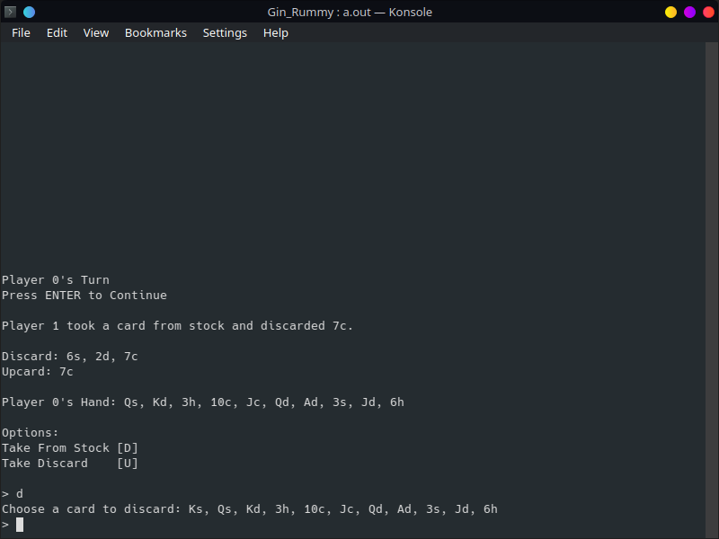

# Gin Rummy
## To Play
Run main_full.cpp  
  
Developed before I really knew about OOP. Thought about revising but might just leave it alone for now...  
Cool thing about this project is that the playing cards are mapped to binary values where bitwise operations were performed for run and meld checking.
